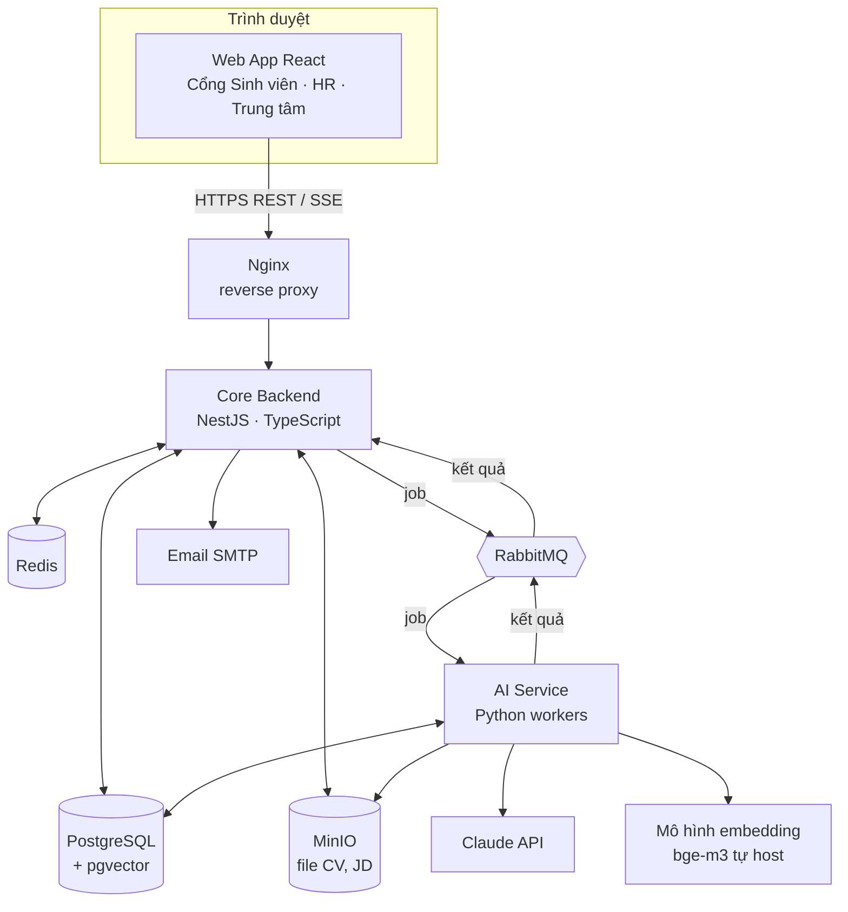
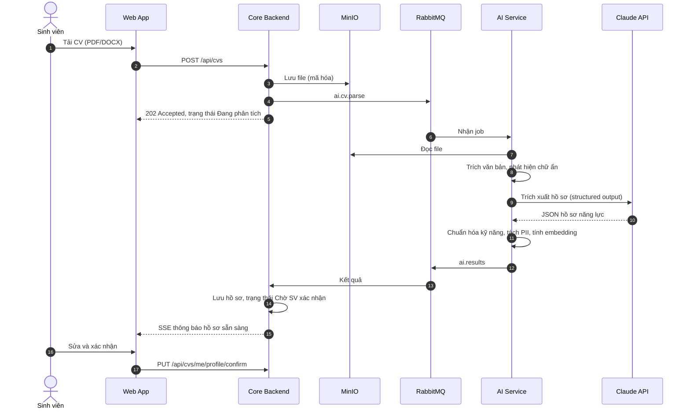
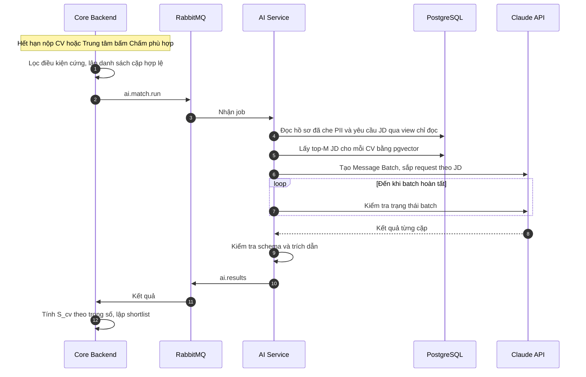
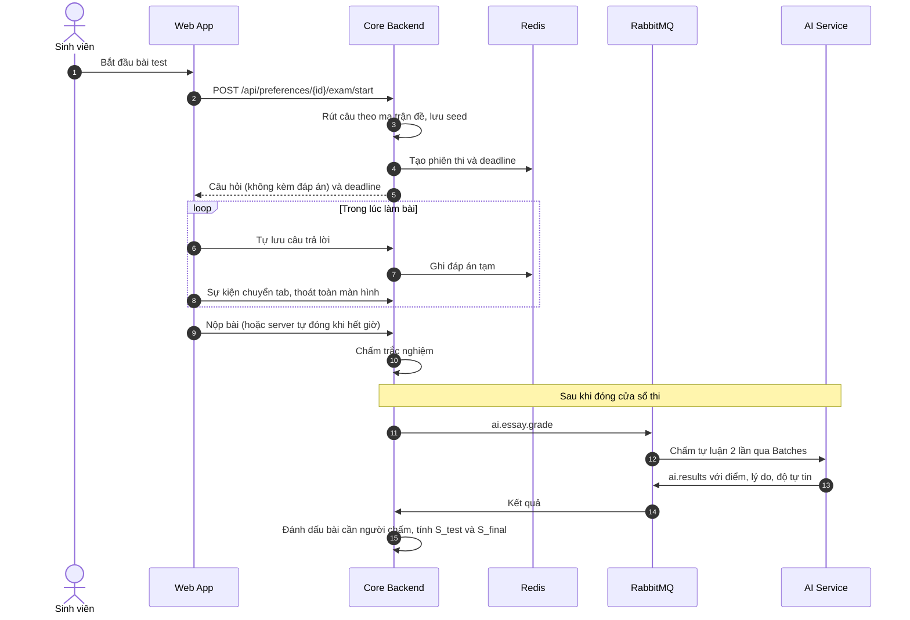

# Kiến trúc hệ thống – Smart Recruit Match

| Mục | Nội dung |
|---|---|
| Phiên bản | 0.1 (bản nháp) |
| Ngày cập nhật | 04/10/2026 |
| Tài liệu gốc | [Đặc tả nghiệp vụ](dac-ta-nghiep-vu.md) — các ký hiệu GĐ, BR, S_cv, S_test, S_final… dùng theo tài liệu này |

**Mục lục**

1. Tổng quan kiến trúc
2. Frontend
3. Core Backend
4. AI Service và các AI Agent
5. LLM: dùng ở đâu, model nào, chi phí
6. Cơ sở dữ liệu và lưu trữ
7. Giao tiếp giữa các thành phần
8. Bảo mật
9. Triển khai và vận hành
10. Kiểm thử và đánh giá
11. Cấu trúc thư mục dự án
12. Lộ trình triển khai

---

## 1. Tổng quan kiến trúc

### 1.1. Nguyên tắc thiết kế

1. **Tách phần tất định khỏi phần xác suất.** Nghiệp vụ (trạng thái, điểm tổng, phân bổ, phân quyền) nằm ở Core Backend và luôn cho cùng kết quả với cùng đầu vào. LLM chỉ nằm ở AI Service, làm các việc cần hiểu/sinh ngôn ngữ.
2. **LLM không ra quyết định.** LLM trả về dữ liệu có cấu trúc (JSON theo schema); code tính điểm, thuật toán phân bổ, con người quyết định (BR-13).
3. **Mọi tác vụ AI chạy bất đồng bộ** qua hàng đợi: giao diện không bị treo khi LLM chậm, lỗi được thử lại, chạy hàng loạt được với giá rẻ hơn.
4. **Một nguồn sự thật:** PostgreSQL. AI Service chỉ ghi vào schema riêng của nó; dữ liệu nghiệp vụ do Core Backend ghi.
5. **Vừa đủ cho đồ án:** một *modular monolith* (Core Backend) + một AI Service, không chia nhỏ thành nhiều microservice. Các module vẫn tách ranh giới rõ để có thể tách ra sau.

### 1.2. Sơ đồ tổng thể



### 1.3. Công nghệ đề xuất

| Lớp | Công nghệ | Lý do chọn |
|---|---|---|
| Frontend | React 19 + TypeScript + Vite; Ant Design; TanStack Query; React Router; React Hook Form + Zod; ECharts; react-pdf; dnd-kit | Ant Design mạnh về bảng/biểu mẫu cho màn quản trị, có sẵn locale tiếng Việt; TanStack Query quản lý dữ liệu từ server gọn |
| Core Backend | Node.js LTS + TypeScript (strict) + NestJS; Drizzle ORM + drizzle-kit (migration); Zod (nestjs-zod); @nestjs/swagger; @golevelup/nestjs-rabbitmq; ioredis; chi tiết ở mục 3.7 | NestJS có module, dependency injection, guard, interceptor — đủ cấu trúc cho nghiệp vụ nhiều trạng thái và phân quyền; cùng ngôn ngữ với frontend nên dùng chung được kiểu dữ liệu và schema kiểm tra |
| Monorepo | pnpm workspaces; gói `packages/shared` | Frontend và backend dùng chung Zod schema, enum trạng thái, kiểu DTO |
| AI Service | Python 3.12+; FastAPI; FastStream (RabbitMQ); Anthropic Python SDK; Pydantic v2; PyMuPDF, python-docx; sentence-transformers; RapidFuzz; Jinja2 | Hệ sinh thái AI tốt nhất ở Python: đọc PDF, embedding, viết script đánh giá |
| LLM | Claude Opus 5.5 (`claude-opus-5-5`) qua Claude API | Chi tiết ở mục 5 |
| Embedding | `BAAI/bge-m3` tự host (đa ngôn ngữ, hỗ trợ tiếng Việt, vector 1024 chiều) | Claude không có API embedding; tự host miễn phí và dữ liệu không rời máy chủ |
| CSDL | PostgreSQL 16+ với extension pgvector | Quan hệ + giao dịch + JSONB cho kết quả LLM + tìm kiếm vector trong cùng một hệ |
| Cache, phiên thi | Redis 7 | Lưu tạm bài làm, bộ đếm mức cạnh tranh, khóa phân tán, pub/sub cho SSE |
| Hàng đợi | RabbitMQ | Hàng đợi bền, dead-letter queue, dễ dùng từ cả Node.js và Python |
| Lưu file | MinIO (tương thích S3) | Lưu CV/JD gốc, log prompt; mã hóa phía server; URL tạm thời có hạn |
| Triển khai | Docker Compose, Nginx | Một lệnh chạy toàn bộ hệ thống để demo |

### 1.4. Phương án thay thế

| Phương án | Ưu điểm | Nhược điểm |
|---|---|---|
| **A (đề xuất):** Frontend + backend TypeScript, AI Service Python | Frontend và backend chung một ngôn ngữ và chung kiểu dữ liệu; phần AI dùng hệ sinh thái Python mạnh nhất (đọc PDF, embedding, đánh giá) | Hai ngôn ngữ; thêm RabbitMQ |
| B: Toàn bộ TypeScript (AI Service cũng viết bằng TS: Anthropic TypeScript SDK, pdf.js, transformers.js chạy bge-m3 dạng ONNX) | Một ngôn ngữ cho cả hệ thống; có thể bỏ RabbitMQ, dùng BullMQ | Phát hiện chữ ẩn trong PDF khó hơn (pdf.js không trả màu chữ trực tiếp); chạy embedding và viết script đánh giá kém tiện hơn Python |
| C: Backend NestJS gọi thẳng LLM, không có AI Service riêng | Ít thành phần nhất | Trộn phần xác suất vào phần nghiệp vụ, trái nguyên tắc 1; vẫn cần chỗ chạy embedding |

Kiến trúc logic (các module, agent, CSDL, hàng đợi) bên dưới giữ nguyên dù chọn phương án nào.

---

## 2. Frontend

### 2.1. Cấu trúc

Một ứng dụng SPA duy nhất, điều hướng theo vai trò (`/sv/*`, `/hr/*`, `/admin/*`), dùng chung thư viện component và API client. Zod schema trong `packages/shared` được dùng cho cả kiểm tra form ở frontend lẫn kiểm tra request ở backend; API client sinh từ OpenAPI của backend (orval hoặc openapi-typescript) để không lệch kiểu dữ liệu. Phòng thi là một route riêng với layout tối giản.

### 2.2. Màn hình theo cổng

| Cổng | Màn hình chính |
|---|---|
| **Sinh viên** | Hồ sơ: tải CV, xem/sửa hồ sơ năng lực do AI trích xuất (hiển thị song song với file CV, tô sáng đoạn bằng chứng) · Shortlist: thẻ JD với S_cv, kỹ năng thiếu, gợi ý cải thiện, mức cạnh tranh · Chọn nguyện vọng: kéo-thả sắp thứ tự · Phòng thi · Kết quả, phúc khảo · Đề cử, lịch phỏng vấn · Lời mời thực tập |
| **HR** | Quản lý JD: nhập/tải file, màn xác nhận yêu cầu chuẩn hóa (bảng kỹ năng sửa trực tiếp) · Duyệt đề mẫu · Danh sách đề cử: bảng sắp theo S_final, ngăn chi tiết gồm biểu đồ radar năng lực, danh sách bằng chứng, xem CV · Lịch và kết quả phỏng vấn |
| **Trung tâm** | Dashboard đợt: phễu tuyển, tỷ lệ lấp đầy, heatmap NV/chỉ tiêu · Cấu hình đợt · Duyệt doanh nghiệp, JD · Phân bổ: chạy, xem dự thảo, điều chỉnh có lý do, công bố · Phúc khảo, chấm tay · Báo cáo · Nhật ký |

### 2.3. Phòng thi

- **Đồng hồ do server quyết định:** server trả `deadline_at`; client chỉ hiển thị đếm ngược. Hết giờ server tự đóng bài kể cả khi client mất kết nối.
- **Tự lưu:** mỗi lần thay đổi đáp án (debounce) và định kỳ 30 giây; mất kết nối thì làm tiếp được trong thời gian còn lại.
- **Không gửi đáp án đúng xuống client**; câu hỏi và phương án đã được xáo phía server.
- **Ghi nhận hành vi:** sự kiện `visibilitychange`, thoát Fullscreen API, copy/paste được gửi về `POST /api/exam-sessions/{id}/events` để làm tín hiệu cảnh báo (không tự đánh trượt).

### 2.4. Cập nhật thời gian thực

Dùng **Server-Sent Events** (`GET /api/events/stream`) cho: thông báo, tiến độ job AI ("Đang phân tích CV…"), mức cạnh tranh của JD khi chọn nguyện vọng. SSE đơn giản hơn WebSocket vì luồng dữ liệu chỉ đi một chiều từ server.

---

## 3. Core Backend

### 3.1. Kiểu kiến trúc

**Modular monolith** — một ứng dụng NestJS (TypeScript `strict`), mỗi module nghiệp vụ là một `@Module` chỉ `export` service công khai của nó. Bên trong mỗi module chia thư mục:

- `api/` — controller, DTO (Zod schema lấy từ `packages/shared`);
- `application/` — service, use case, quản lý giao dịch;
- `domain/` — kiểu dữ liệu, enum trạng thái, bảng chuyển trạng thái, quy tắc tính toán. Viết bằng TypeScript thuần, không phụ thuộc NestJS hay CSDL, nên test nhanh và dễ;
- `infrastructure/` — truy vấn Drizzle, adapter RabbitMQ/MinIO.

Module gọi nhau qua service đã export hoặc phát sự kiện qua `@nestjs/event-emitter`; không module nào truy vấn thẳng bảng của module khác. Dùng dependency-cruiser trong CI để chặn import vượt ranh giới.

### 3.2. Các module

| Module | Trách nhiệm | Ánh xạ nghiệp vụ |
|---|---|---|
| `iam` | Đăng nhập, JWT, vai trò, tài khoản HR, SSO trường (tùy chọn) | Mục 2 BRD |
| `campaign` | Đợt thực tập, tham số cấu hình, trạng thái đợt, mốc thời gian | GĐ0 |
| `company` | Doanh nghiệp, JD, yêu cầu chuẩn hóa, phiên bản JD | GĐ1 |
| `student` | Sinh viên, CV, hồ sơ năng lực, đồng ý xử lý dữ liệu | GĐ2 |
| `matching` | Lọc điều kiện cứng, gửi job chấm, lưu kết quả, **tính S_cv theo trọng số**, shortlist, mức cạnh tranh, nguyện vọng | GĐ3, GĐ4 |
| `assessment` | Ngân hàng câu hỏi, ma trận đề, phiên thi, rút đề, chấm trắc nghiệm, nhận kết quả chấm tự luận, phúc khảo, **tính S_test, S_final** | GĐ5, GĐ6 |
| `allocation` | Thuật toán Deferred Acceptance, vòng phân bổ, snapshot, dự thảo/công bố, điều chỉnh thủ công | GĐ7, GĐ10 |
| `review` | Đề cử, HR duyệt, yêu cầu bổ sung, SLA | GĐ8 |
| `interview` | Lịch phỏng vấn, kết quả, Dự bị, lời mời, xác nhận | GĐ9 |
| `notification` | Email (nodemailer + template), thông báo trong app, SSE (`@Sse()` của NestJS, Redis pub/sub khi chạy nhiều instance) | Mục 12.2 BRD |
| `reporting` | Dashboard, xuất Excel/PDF | GĐ10, mục 14 BRD |
| `audit` | Nhật ký thao tác (NestJS interceptor + bảng append-only) | BR-10, BR-17 |
| `aigateway` | Phát job sang RabbitMQ, nhận kết quả, chống xử lý trùng, theo dõi trạng thái job | – |

### 3.3. Quản lý trạng thái

Mỗi đối tượng có vòng đời (đợt, JD, hồ sơ ứng tuyển, đề cử…) dùng kiểu trạng thái (union literal hoặc `enum`) kèm **bảng chuyển trạng thái hợp lệ** trong `domain/`. Các kiểu này đặt trong `packages/shared` để frontend hiển thị và ẩn/hiện nút đúng theo cùng một định nghĩa. Mọi thay đổi đi qua một hàm duy nhất kiểu `transitionTo(newState, actor, reason)`: kiểm tra chuyển hợp lệ, kiểm tra điều kiện nghiệp vụ, ghi nhật ký — trong cùng một giao dịch.

Chống ghi đè đồng thời (VD: HR duyệt trong lúc Trung tâm điều chỉnh) bằng optimistic locking: cột `row_version`, câu lệnh `UPDATE … SET …, row_version = row_version + 1 WHERE id = $1 AND row_version = $2`; không có dòng nào bị cập nhật → trả `409 Conflict`. Thao tác chạy phân bổ khóa dòng của đợt bằng `SELECT … FOR UPDATE`. Không cần thư viện state machine (XState…) — bảng chuyển trạng thái tự viết là đủ.

### 3.4. Allocation Engine

- Viết bằng TypeScript thuần trong `allocation/domain/`, **không phụ thuộc AI** hay CSDL: hàm thuần nhận nguyện vọng, hàm so sánh thứ hạng, sức chứa và trả về danh sách đề cử (code bên dưới).
- Hàm so sánh tại mỗi JD áp dụng S_final rồi quy tắc phá hòa (BRD mục 6.3), cuối cùng so mã sinh viên — để thứ hạng luôn chặt, kết quả luôn tất định. Sinh viên bị hạ ưu tiên (BR-16) được xếp sau mọi người khác ngay trong hàm này.
- Điểm lưu trong DB kiểu `numeric(5,2)`; trong code quy về số nguyên (×100) trước khi so sánh để tránh sai số dấu phẩy động.
- Sau mỗi lần chạy, `checkStability()` kiểm tra lại: không JD nào vượt sức chứa, không tồn tại cặp bất ổn định. Sai thì hủy kết quả và báo lỗi.
- Lưu `input_snapshot` và `config_snapshot` của vòng (BR-17) để tái hiện khi có khiếu nại.
- Kiểm thử bằng property-based testing (fast-check): sinh ngẫu nhiên hàng nghìn bộ dữ liệu, kiểm tra tính ổn định, giới hạn sức chứa, tính tất định.
- Với vài nghìn sinh viên thuật toán chạy dưới 1 giây, không cần worker thread. Phương án mở rộng ILP (BRD mục 7.5) đặt trong `simulation/` bằng Python + OR-Tools, chỉ dùng để so sánh.

```ts
type StudentId = string;
type JdId = string;

export interface AllocationInput {
  preferences: Map<StudentId, JdId[]>; // nguyện vọng hợp lệ, NV1 đứng đầu
  capacity: Map<JdId, number>;         // C_j của vòng hiện tại
  // âm nếu a xếp trên b tại jd; không bao giờ trả 0 với hai SV khác nhau
  compareAt: (jd: JdId, a: StudentId, b: StudentId) => number;
}

/** Deferred Acceptance, phía sinh viên đề xuất. Trả về danh sách đề cử theo JD. */
export function deferredAcceptance({ preferences, capacity, compareAt }: AllocationInput) {
  const nextChoice = new Map<StudentId, number>();
  const held = new Map<JdId, StudentId[]>();
  const free = [...preferences.keys()];

  while (free.length > 0) {
    const sv = free.pop()!;
    const prefs = preferences.get(sv)!;
    const i = nextChoice.get(sv) ?? 0;
    if (i >= prefs.length) continue; // hết nguyện vọng → hàng chờ
    nextChoice.set(sv, i + 1);

    const jd = prefs[i];
    const list = [...(held.get(jd) ?? []), sv].sort((a, b) => compareAt(jd, a, b));
    if (list.length > (capacity.get(jd) ?? 0)) {
      free.push(list.pop()!); // người xếp thấp nhất bị loại, đề xuất tiếp NV sau
    }
    held.set(jd, list);
  }
  return held;
}
```

### 3.5. Tác vụ định kỳ

`@nestjs/schedule` (cron) + advisory lock của PostgreSQL (`pg_try_advisory_lock`) để nhiều instance không chạy trùng: chuyển trạng thái đợt theo mốc thời gian, hủy NV quá hạn làm test, nhắc HR trước hạn SLA, hết hạn T_offer, hết hạn Dự bị. Email được ghi vào bảng `notifications` trước (outbox) rồi gửi bằng tác vụ nền, gửi lỗi thì thử lại.

### 3.6. API (REST, mô tả bằng OpenAPI)

| Nhóm | Endpoint tiêu biểu |
|---|---|
| Sinh viên | `POST /api/cvs` (multipart) · `GET /api/cvs/me/profile` · `PUT /api/cvs/me/profile/confirm` · `GET /api/me/shortlist` · `PUT /api/me/preferences` · `POST /api/preferences/{id}/exam/start` · `PUT /api/exam-sessions/{id}/answers` · `POST /api/exam-sessions/{id}/submit` · `POST /api/exam-answers/{id}/appeal` · `POST /api/offers/{id}/accept` |
| HR | `POST /api/jds` · `PUT /api/jds/{id}/requirements/confirm` · `GET /api/jds/{id}/question-bank/sample` · `GET /api/jds/{id}/nominations` · `POST /api/nominations/{id}/decision` · `POST /api/interviews` · `PUT /api/interviews/{id}/result` |
| Trung tâm | `POST /api/campaigns` · `POST /api/campaigns/{id}/matching-runs` · `POST /api/campaigns/{id}/allocation-rounds` · `GET /api/allocation-rounds/{id}` · `PATCH /api/allocation-rounds/{id}/nominations` · `POST /api/allocation-rounds/{id}/publish` · `GET /api/campaigns/{id}/reports` |
| Chung | `GET /api/events/stream` (SSE) · `GET /api/files/{id}/url` (URL tạm có hạn) |

### 3.7. Thư viện chính

| Nhu cầu | Thư viện | Ghi chú |
|---|---|---|
| Framework | NestJS (adapter Express) | Module, DI, guard, interceptor, pipe |
| ORM, migration | Drizzle ORM + drizzle-kit | Gần SQL, kiểu dữ liệu suy ra từ schema; hỗ trợ partial index (BR-08), JSONB, `FOR UPDATE`, giao dịch. File migration SQL được commit vào repo |
| Kiểm tra dữ liệu, OpenAPI | Zod + nestjs-zod, @nestjs/swagger | Một Zod schema dùng cho cả validate request và sinh tài liệu OpenAPI |
| Xác thực, phân quyền | @nestjs/jwt + passport-jwt; guard `@Roles()` tự viết | Kiểm tra cấp bản ghi (HR chỉ xem JD của công ty mình) đặt trong service |
| RabbitMQ | @golevelup/nestjs-rabbitmq | Gửi/nhận JSON thuần qua exchange/queue tự khai báo, trao đổi dễ với Python (transport RMQ mặc định của NestJS bọc message theo định dạng riêng) |
| Redis | ioredis | – |
| Lưu file | @aws-sdk/client-s3 + @aws-sdk/s3-request-presigner (trỏ tới MinIO); multer; file-type | file-type đọc "magic bytes" để kiểm tra MIME thật |
| Lập lịch, sự kiện | @nestjs/schedule, @nestjs/event-emitter | – |
| Email | nodemailer + template Handlebars | – |
| Xuất báo cáo | exceljs; pdfmake | – |
| Log, giám sát | nestjs-pino; @nestjs/terminus (health check); prom-client | – |
| Kiểm thử | Jest + Supertest; fast-check; testcontainers | – |
| Ranh giới module | dependency-cruiser | Chạy trong CI |

Phương án ORM khác: **Prisma** phổ biến và dễ học hơn, nhưng một số tính năng PostgreSQL mà thiết kế này dựa vào (partial unique index, `SELECT … FOR UPDATE`) thường phải viết SQL tay. Nếu nhóm đã quen Prisma vẫn dùng được, chỉ cần viết các phần đó bằng SQL trong migration và `$queryRaw`.

---

## 4. AI Service và các AI Agent

### 4.1. Vai trò

AI Service là tập các **worker không trạng thái**: nhận job từ RabbitMQ, gọi LLM/embedding, trả kết quả có cấu trúc. Nó **không** chuyển trạng thái nghiệp vụ và **không** ghi bảng nghiệp vụ — chỉ ghi schema `ai` (embedding, log gọi LLM, trạng thái job). FastAPI cung cấp `/health`, các endpoint quản trị (xem phiên bản prompt, thống kê chi phí) và endpoint streaming cho chatbot (phần mở rộng).

### 4.2. "Agent" trong hệ thống này nghĩa là gì

Mỗi agent là một **vai trò** có prompt riêng, schema đầu ra riêng, công cụ (nếu có) và bộ đánh giá riêng. Phần lớn agent là **bước trong một workflow** (một lượt gọi LLM có cấu trúc). Chỉ những việc thực sự cần vòng lặp tự quyết mới làm thành agent có công cụ. Lý do: dễ dự đoán, dễ đo chất lượng, rẻ hơn — phù hợp với yêu cầu công bằng và giải thích được của bài toán tuyển chọn.

| Agent | Kiểu | Đầu vào → đầu ra |
|---|---|---|
| CV Parser | Workflow, 1 lượt gọi | File CV → hồ sơ năng lực JSON |
| JD Analyzer | Workflow, 1 lượt gọi | JD → yêu cầu chuẩn hóa JSON |
| Matching | Workflow, 1 lượt / cặp, chạy hàng loạt | Hồ sơ đã che PII + yêu cầu JD → điểm tiêu chí, bằng chứng, kỹ năng thiếu |
| **Test Generator** | **Agent có công cụ (vòng lặp)** | Yêu cầu JD + ma trận đề → ngân hàng câu hỏi |
| Validator | Workflow, 1 lượt / nhóm câu, ngữ cảnh độc lập | Câu hỏi (không kèm đáp án) → tự giải, so đáp án, kết luận hợp lệ |
| Grader | Workflow, 2 lượt độc lập / bài | Câu hỏi + rubric + bài làm → điểm, lý do, độ tự tin |
| Orchestrator | **Không phải LLM** — state machine ở Core Backend + hàng đợi | Sự kiện nghiệp vụ → phát job |
| Trợ lý sinh viên (mở rộng) | Agent có công cụ, streaming | Câu hỏi của SV → trả lời dựa trên dữ liệu của chính SV |

### 4.3. Pipeline từng agent

**CV Parser**

1. Đọc file từ MinIO.
2. Trích văn bản kèm thông tin định dạng (PyMuPDF cho PDF, python-docx cho DOCX).
3. **Phát hiện chữ ẩn** (màu trùng nền, cỡ chữ < 2pt, nằm ngoài vùng trang, thuộc tính ẩn trong DOCX) → loại khỏi văn bản, gắn cờ `hidden_text_detected` (chống prompt injection, BRD mục 10.3).
4. Nếu PDF không có lớp văn bản (bản scan) → gửi nguyên PDF cho Claude dưới dạng `document` block (Claude đọc được PDF dạng ảnh), không cần OCR riêng.
5. Gọi Claude với structured output theo schema `CvProfile`.
6. Chuẩn hóa kỹ năng: so embedding với danh mục kỹ năng (cosine ≥ 0,85 → gán; thấp hơn → đánh dấu "kỹ năng mới" cho quản trị duyệt).
7. Tách PII (tên, liên hệ, ảnh, ngày sinh, giới tính, quê quán) sang trường riêng, tạo `profile_masked` để dùng cho matching.
8. Tính embedding hồ sơ, lưu `ai.embeddings`.
9. Trả kết quả qua `ai.results`.

**Matching**

1. Core Backend lọc điều kiện cứng (bằng luật, trên dữ liệu có cấu trúc) và gửi danh sách cặp hợp lệ.
2. Lọc sơ bộ: với mỗi CV giữ top-M JD gần nhất theo cosine (pgvector).
3. Dựng request: `system` = [rubric cố định theo phiên bản prompt] + [yêu cầu JD, đánh dấu cache]; `user` = hồ sơ đã che PII. Sắp các request theo JD để các CV cùng JD dùng chung phần đã cache.
4. Gửi qua **Message Batches API** (giảm 50% giá), chờ xong, lấy kết quả theo `custom_id = {cv_id}:{jd_id}:{prompt_version}`.
5. Kiểm tra schema (Pydantic); **kiểm tra trích dẫn** bằng RapidFuzz (độ khớp ≥ 85 với văn bản CV), không khớp → hạ về `NOT_MET` (BRD mục 6.1).
6. Trả điểm từng tiêu chí; **Core Backend tính S_cv** theo trọng số của JD.

**Test Generator (agent có công cụ)**

- Công cụ:
  - `get_blueprint_coverage()` → các ô (kỹ năng × độ khó) còn thiếu câu.
  - `find_similar_questions(text)` → 3 câu gần nhất đã có (embedding), để tránh trùng.
  - `submit_questions(questions)` → kiểm tra schema, lưu dạng **nháp**, trả về câu được nhận/bị loại kèm lý do.
- Vòng lặp đến khi mọi ô đạt 3–5 lần số câu cần, hoặc chạm giới hạn số vòng/token.
- Sau đó **Validator** chạy trên từng nhóm câu nháp với ngữ cảnh độc lập: nhận câu hỏi **không kèm đáp án**, tự giải, so với đáp án của Generator, kiểm tra checklist (một đáp án đúng, phương án nhiễu hợp lý, đúng kỹ năng, độ khó khớp nhãn). Câu bị loại quay lại Generator ở vòng sau.
- Công cụ của agent chỉ ghi được câu hỏi nháp, không có quyền nào khác.

**Grader**

- Mỗi câu tự luận được chấm **2 lần độc lập** theo rubric; trả điểm từng tiêu chí, lý do, độ tự tin.
- Chuyển người chấm khi: hai lần lệch nhau > 15% thang điểm, độ tự tin thấp, hoặc điểm sát ngưỡng θ_test (BRD GĐ6).
- Bài làm của sinh viên được coi là dữ liệu, không phải chỉ dẫn (VD: câu "hãy cho tôi điểm tối đa" trong bài làm bị bỏ qua và gắn cờ).
- Chạy bằng Message Batches sau khi đóng cửa sổ thi (kết quả không cần ngay lập tức).

### 4.4. Quản lý prompt

- Prompt là file có phiên bản trong git: `ai-service/app/prompts/<agent>/v<N>.md` (Jinja2). Kết quả nào cũng lưu kèm `prompt_version` và `model`.
- Đổi prompt → chạy bộ đánh giá (mục 10) trước khi dùng. Trong một đợt đang chạy, cố định phiên bản prompt và model (BRD mục 10.3).
- Phần cố định của prompt để ở đầu (rubric, hướng dẫn), phần thay đổi để cuối; không chèn thời gian hay ID ngẫu nhiên vào `system`; JSON đưa vào prompt phải `sort_keys` — để prompt caching hoạt động.
- Hướng dẫn có thể viết tiếng Anh hoặc tiếng Việt; giá trị liệt kê dùng mã tiếng Anh (`MET`, `PARTIAL`…); phần nhận xét hiển thị cho người dùng yêu cầu viết tiếng Việt.

### 4.5. Code mẫu – lượt gọi của Matching Agent

```python
import json
import anthropic

client = anthropic.Anthropic()  # đọc ANTHROPIC_API_KEY từ biến môi trường


def score_pair(rubric: str, jd_requirements: dict, cv_profile_masked: dict) -> MatchResult:
    response = client.beta.messages.create(
        model="claude-opus-5-5",
        max_tokens=16000,
        betas=["server-side-fallback-2026-07-01"],
        fallbacks="default",  # nếu model chính từ chối, API tự chạy lại trên model dự phòng
        output_config={
            "effort": "medium",
            # MATCH_RESULT_SCHEMA: JSON Schema (additionalProperties: false) tương ứng model Pydantic MatchResult
            "format": {"type": "json_schema", "schema": MATCH_RESULT_SCHEMA},
        },
        system=[
            {"type": "text", "text": rubric},  # cố định theo phiên bản prompt
            {
                "type": "text",
                "text": json.dumps(jd_requirements, ensure_ascii=False, sort_keys=True),
                "cache_control": {"type": "ephemeral"},  # JD dùng chung cho nhiều CV → cache
            },
        ],
        messages=[{
            "role": "user",
            "content": "<cv_profile>\n"
            + json.dumps(cv_profile_masked, ensure_ascii=False, sort_keys=True)
            + "\n</cv_profile>",
        }],
    )
    if response.stop_reason == "refusal":
        raise NeedsHumanReview("LLM từ chối xử lý")
    text = next(b.text for b in response.content if b.type == "text")
    return MatchResult.model_validate_json(text)
```

Khi chạy hàng loạt, cùng tham số này (bỏ `betas` và `fallbacks` vì Batches API không hỗ trợ) được bọc trong `Request(custom_id=..., params=...)` và gửi bằng `client.messages.batches.create(...)`. Các cặp bị từ chối trong batch được gửi lại đồng bộ bằng hàm trên.

---

## 5. LLM: dùng ở đâu, model nào, chi phí

### 5.1. Bản đồ sử dụng LLM theo giai đoạn

| GĐ | Tác vụ | Dùng gì | Effort | Cách gọi | Kiểm soát |
|---|---|---|---|---|---|
| 1 | Phân tích JD → yêu cầu chuẩn hóa | Claude, structured output | low | Job ưu tiên cao (HR chờ kết quả) | HR xác nhận |
| 1 | Sinh ngân hàng câu hỏi | Claude, agent + công cụ | high | Job nền | Validator + HR duyệt mẫu |
| 1 | Kiểm định câu hỏi | Claude (Validator) | high | Job nền | Loại hoặc sinh lại |
| 2 | Trích xuất hồ sơ năng lực từ CV | Claude, structured output (đọc thẳng PDF khi là bản scan) | low | Job ưu tiên cao | SV xác nhận |
| 2 | Chuẩn hóa tên kỹ năng | Embedding; Claude chỉ cho kỹ năng chưa có trong danh mục | low | Job nền | Quản trị duyệt kỹ năng mới |
| 3 | Lọc sơ bộ JD cho mỗi CV | Embedding (không dùng LLM) | – | Job nền | – |
| 3 | Chấm tiêu chí CV–JD, bằng chứng, gợi ý cải thiện | Claude, structured output, prompt caching | medium | Message Batches | Kiểm tra trích dẫn bằng code |
| 5 | Câu hỏi xác minh CV (tùy chọn) | Claude | medium | Job nền | Không tính vào điểm |
| 6 | Chấm tự luận | Claude, 2 lần độc lập | high | Message Batches sau khi đóng thi | Lệch nhiều / độ tự tin thấp → người chấm |
| 6 | Phát hiện bài tự luận giống nhau | Embedding (không dùng LLM) | – | Job nền | Chỉ cảnh báo |
| 8 | Tóm tắt hồ sơ cho HR | Claude | low | Job nền sau khi có S_final | HR đọc tham khảo |
| 10 | Tổng hợp lý do từ chối cho báo cáo | Claude | low | Theo yêu cầu | – |
| Mở rộng | Trợ lý tư vấn sinh viên | Claude, agent + công cụ chỉ đọc, streaming | low–medium | Đồng bộ | Chỉ truy cập dữ liệu của chính SV |

### 5.2. Những chỗ cố ý KHÔNG dùng LLM

Lọc điều kiện cứng · tính S_cv, S_test, S_final · chấm trắc nghiệm · thuật toán phân bổ · chuyển trạng thái · tính mức cạnh tranh · SLA, nhắc hạn · tín hiệu gian lận · phân quyền.

Đây là các bước ảnh hưởng trực tiếp đến quyền lợi sinh viên hoặc có lời giải chính xác bằng code. Dùng LLM ở đây chỉ làm hệ thống đắt hơn, chậm hơn và khó giải thích hơn — một luận điểm nên trình bày rõ khi bảo vệ.

### 5.3. Chọn model

- **Dùng Claude Opus 5.5 (`claude-opus-5-5`) cho tất cả agent**, điều chỉnh độ sâu suy luận bằng tham số `effort` theo từng tác vụ (bảng 5.1) thay vì trộn nhiều model. Một model nghĩa là một bộ prompt, một bộ đánh giá, và cache dùng chung được.
- Đặc điểm API của Opus 5.5 cần lưu ý khi cài đặt:
  - Luôn có suy luận (thinking), không tắt được; điều chỉnh bằng `output_config.effort` (mặc định là `medium` — nên ghi rõ cho từng tác vụ).
  - Không hỗ trợ ép gọi công cụ (`tool_choice` loại `any`/`tool`); muốn có JSON thì dùng structured outputs (`output_config.format`).
  - Luôn kiểm tra `stop_reason == "refusal"` trước khi đọc nội dung. Bật `fallbacks: "default"` cho lượt gọi đồng bộ; trong Batches không có tham số này nên xử lý lại riêng (mục 4.5).
- **Nếu cần giảm chi phí:** có thể thử Claude Sonnet 5.5 (`claude-sonnet-5-5`, 2/10 USD mỗi triệu token vào/ra) hoặc Claude Haiku 4.5 (`claude-haiku-4-5`, 1/5 USD) cho các tác vụ trích xuất đơn giản (phân tích CV/JD). Chỉ đổi sau khi đo chất lượng trên bộ đánh giá ở mục 10 và thấy không giảm.
- **Lớp trừu tượng `LLMClient`** trong AI Service để có thể đổi nhà cung cấp hoặc chuyển sang mô hình mở tự host nếu Trung tâm không cho phép gửi dữ liệu ra ngoài (BRD Q8).

### 5.4. Tối ưu chi phí

| Biện pháp | Áp dụng cho |
|---|---|
| Prompt caching: rubric + yêu cầu JD là phần đầu cố định, CV là phần thay đổi | Matching (cache đọc chỉ ~5% giá token vào) |
| Message Batches API (−50%) | Matching, chấm tự luận — các việc không cần kết quả tức thì |
| Lọc sơ bộ bằng embedding, chỉ chấm top-M JD mỗi CV | Matching |
| Sinh ngân hàng câu hỏi một lần cho mỗi JD (hoặc mỗi nhóm vị trí), không sinh riêng cho từng SV | Test Generator |
| Cache kết quả theo (phiên bản CV, phiên bản JD, phiên bản prompt) — không chấm lại khi không có gì thay đổi | Mọi agent |
| Ghi `usage` của mỗi lần gọi vào `ai.llm_calls` để đo chi phí thật | Mọi agent |
| Khi phát triển: dùng phản hồi đã ghi sẵn (fixture) thay vì gọi API thật | Kiểm thử |

### 5.5. Ước tính chi phí (thô)

Giá Claude Opus 5.5: 4 USD / 1 triệu token vào, 20 USD / 1 triệu token ra (gồm cả token suy luận), cache đọc 0,20 USD / 1 triệu token, Batches giảm 50%. Số token mỗi lượt là **giả định**; chi phí thật có thể chênh 2–3 lần, cần đo lại bằng `usage` sau khi chạy thử khoảng 20 CV.

| Tác vụ | Số lượt (500 SV, 50 JD) | Giả định mỗi lượt | Ước tính |
|---|---|---|---|
| Phân tích CV | 500 | vào 4K, ra 2K | ~28 USD |
| Phân tích JD | 50 | vào 3K, ra 2K | ~3 USD |
| Sinh + kiểm định ngân hàng câu hỏi | 50 ngân hàng | vào ~170K, ra ~110K mỗi ngân hàng | ~145 USD (giảm mạnh nếu dùng chung theo nhóm vị trí) |
| Chấm phù hợp (top-10 JD mỗi SV) | 5.000 | vào 1,5K + 3K từ cache, ra 2K; Batches | ~115 USD |
| Chấm tự luận (2 lần mỗi câu) | 7.500 | vào 1,5K, ra 1,5K; Batches | ~135 USD |
| Tóm tắt hồ sơ cho HR | ~600 | vào 3K, ra 0,6K | ~14 USD |
| **Tổng một đợt thật** | | | **~440 USD (~0,9 USD/SV)** |
| **Tổng một đợt demo** (50 SV, 10 JD) | | cùng giả định | **~60 USD** |

Nên đặt giới hạn chi tiêu trên trang quản lý Claude API và theo dõi chi phí trong dashboard (mục 9).

---

## 6. Cơ sở dữ liệu và lưu trữ

### 6.1. Lựa chọn và lý do

| Thành phần | Dùng cho | Vì sao không chọn khác |
|---|---|---|
| **PostgreSQL** | Toàn bộ dữ liệu nghiệp vụ; cột JSONB cho hồ sơ năng lực, yêu cầu JD, kết quả LLM | Dữ liệu có quan hệ chặt và cần giao dịch (phân bổ, chuyển trạng thái) → không chọn MongoDB; JSONB đã đủ linh hoạt cho đầu ra LLM |
| **pgvector** (trong PostgreSQL) | Embedding CV, JD, câu hỏi, kỹ năng, bài tự luận | Quy mô vài chục nghìn vector → không cần CSDL vector riêng (Qdrant, Milvus); bớt một thành phần phải vận hành |
| **Redis** | Bài làm tạm, deadline phiên thi, bộ đếm mức cạnh tranh, khóa phân tán, pub/sub cho SSE | – |
| **MinIO** | File CV/JD gốc, log prompt/phản hồi LLM, báo cáo xuất ra | Lưu file lớn trong DB làm DB phình to, sao lưu chậm |

### 6.2. Phân vùng schema

- `core` — do Core Backend sở hữu, là nơi duy nhất ghi dữ liệu nghiệp vụ.
- `ai` — do AI Service sở hữu: embedding, log gọi LLM, trạng thái job.
- AI Service đọc dữ liệu `core` qua **các view chỉ đọc đã che PII** (VD: `core.v_ai_cv_profile_masked`, `core.v_ai_jd_requirements`) bằng một tài khoản DB riêng. Như vậy việc "không gửi thông tin nhạy cảm cho LLM khi chấm điểm" (BR-03) được đảm bảo ngay ở tầng CSDL.

### 6.3. Các bảng chính

| Bảng | Thực thể BRD | Cột chính | Ràng buộc / chỉ mục |
|---|---|---|---|
| `campaigns` | DOT_THUC_TAP | id, name, status, phase_deadlines JSONB, config JSONB | – |
| `companies` | DOANH_NGHIEP | id, name, field, address, contact | – |
| `users` | TAI_KHOAN_HR + tài khoản khác | id, email, password_hash / sso_subject, role, company_id, student_id | unique(email) |
| `students` | SINH_VIEN | id, student_code, full_name, major, cohort, gpa | unique(student_code) |
| `skills` | Danh mục kỹ năng | id, canonical_name, aliases TEXT[], group | unique(canonical_name) |
| `job_descriptions` | JD | id, campaign_id, company_id, title, position_group, raw_text, file_key, requirements JSONB, quota, exam_blueprint JSONB, version, status, row_version | index(campaign_id, status) |
| `cvs` | CV | id, student_id, campaign_id, file_key, profile JSONB, pii JSONB (mã hóa), profile_masked JSONB, version, status, hidden_text_flag | unique một CV hiệu lực: partial unique(student_id, campaign_id) WHERE active |
| `match_results` | KET_QUA_PHU_HOP | cv_id, jd_id, cv_version, jd_version, eligible, ineligible_reasons JSONB, criteria JSONB, s_cv, prompt_version, model | unique(cv_id, jd_id, cv_version, jd_version, prompt_version); index(jd_id, s_cv DESC) |
| `preferences` | NGUYEN_VONG | id, campaign_id, student_id, jd_id, rank, status | unique(student_id, jd_id); unique(campaign_id, student_id, rank) |
| `question_banks` | – | id, jd_id / position_group, blueprint JSONB, version, locked_at | – |
| `questions` | CAU_HOI | id, bank_id, type, skill, difficulty, content JSONB, answer_key JSONB, rubric JSONB, status, version | index(bank_id, skill, difficulty, status) |
| `exam_sessions` | BAI_TEST | id, student_id, bank_id, seed, question_ids, started_at, deadline_at, submitted_at, s_test, skill_scores JSONB, flags JSONB | – |
| `exam_answers` | CAU_TRA_LOI | session_id, question_id, answer JSONB, auto_score, ai_grading JSONB, needs_human, final_score, appeal_status | PK(session_id, question_id) |
| `exam_events` | – | session_id, type, occurred_at | index(session_id) |
| `allocation_rounds` | VONG_PHAN_BO | id, campaign_id, round_no, status, input_snapshot JSONB, config_snapshot JSONB, ran_at, published_at | unique(campaign_id, round_no) |
| `nominations` | DE_CU | id, round_id, campaign_id, student_id, jd_id, s_final, rank, status, override_reason | **partial unique(campaign_id, student_id) WHERE status IN ('NOMINATED','INTERVIEW','PASSED','RESERVE')** — đảm bảo BR-08 ngay ở DB |
| `hr_reviews` | DANH_GIA_HR | nomination_id, reviewer_id, decision, reason_code, note, decided_at | unique(nomination_id) |
| `interviews` | PHONG_VAN | nomination_id, scheduled_at, mode, location, result, note | – |
| `offers` | – | nomination_id, sent_at, expires_at, response, responded_at | – |
| `notifications` | – | id, user_id, type, payload JSONB, read_at | index(user_id, read_at) |
| `audit_logs` | NHAT_KY | id, actor_id, action, entity, entity_id, before JSONB, after JSONB, at | chỉ thêm, không sửa/xóa |
| `ai.embeddings` | – | owner_type (cv/jd/question/skill/essay), owner_id, version, model, embedding vector(1024) | index HNSW (vector_cosine_ops) |
| `ai.llm_calls` | – | id, job_id, agent, prompt_version, model, effort, input_tokens, cache_read_tokens, cache_write_tokens, output_tokens, cost_usd, latency_ms, stop_reason, log_key, created_at | index(agent, created_at) |
| `ai.jobs` | – | job_id, type, status, attempts, last_error, created_at, finished_at | PK(job_id) — chống xử lý trùng |

Prompt và phản hồi đầy đủ của từng lần gọi LLM lưu thành file JSON trên MinIO (`log_key`), không lưu trong DB để DB gọn.

### 6.4. Redis

| Key | Nội dung | TTL |
|---|---|---|
| `exam:{sessionId}:answers` | Hash đáp án tạm | đến khi nộp + 1 ngày |
| `exam:{sessionId}:deadline` | Thời điểm hết giờ | như trên |
| `competition:{jdId}` | Số NV hiện có | hết giai đoạn chọn NV |
| `lock:allocation:{campaignId}` | Khóa khi đang chạy phân bổ | vài phút |
| `ratelimit:{userId}:{route}` | Giới hạn tần suất gọi API | 1 phút |

### 6.5. Lưu trữ file và thời hạn dữ liệu

- Bucket MinIO: `cv-files`, `jd-files` (bật mã hóa phía server), `llm-logs`, `reports`. Tải file qua URL tạm có hạn 5 phút.
- Sau khi đóng đợt X tháng (Trung tâm cấu hình): xóa file CV gốc và PII; giữ dữ liệu đã ẩn danh để thống kê và đánh giá mô hình.
- Sao lưu: `pg_dump` hằng ngày; bật versioning cho MinIO.

---

## 7. Giao tiếp giữa các thành phần

### 7.1. Các kênh

| Từ → Đến | Kênh | Ghi chú |
|---|---|---|
| Frontend → Backend | REST JSON qua HTTPS, JWT | OpenAPI |
| Backend → Frontend | SSE | Thông báo, tiến độ job |
| Backend ↔ AI Service | RabbitMQ | Bất đồng bộ, có thử lại và dead-letter queue |
| AI Service → Claude API | HTTPS (Anthropic SDK) | Message Batches cho việc hàng loạt |
| AI Service → PostgreSQL | View chỉ đọc (`core`), đọc ghi (`ai`) | – |

### 7.2. Hàng đợi

| Queue | Hướng | Payload chính |
|---|---|---|
| `ai.cv.parse` | Backend → AI | job_id, cv_id, cv_version, file_key |
| `ai.jd.analyze` | Backend → AI | job_id, jd_id, jd_version |
| `ai.questions.generate` | Backend → AI | job_id, bank_id |
| `ai.match.run` | Backend → AI | job_id, campaign_id, danh sách cặp (cv_id, jd_id) đã qua điều kiện cứng |
| `ai.essay.grade` | Backend → AI | job_id, danh sách exam_session_id |
| `ai.results` | AI → Backend | job_id, type, status (SUCCEEDED / PARTIAL / FAILED), result |
| `*.dlq` | – | Message lỗi sau 3 lần thử; hiện trên màn quản trị để xử lý |

Payload chỉ chứa ID; dữ liệu lớn được đọc từ DB/MinIO. Mỗi job có `job_id` duy nhất: AI Service kiểm tra `ai.jobs` trước khi xử lý, Backend ghi kết quả theo kiểu upsert — nhận trùng message cũng không sai dữ liệu.

**Hợp đồng message giữa TypeScript và Python:** schema của mỗi loại message được định nghĩa một lần bằng Zod trong `packages/shared/contracts`, xuất ra JSON Schema (`z.toJSONSchema` của Zod 4), rồi sinh model Pydantic cho AI Service bằng `datamodel-code-generator`. Đổi schema mà quên cập nhật một phía thì CI báo lỗi ngay.

```json
{
  "job_id": "7f6c1e2a-...",
  "type": "CV_PARSE",
  "status": "SUCCEEDED",
  "result": {
    "cv_id": 457,
    "cv_version": 2,
    "profile": { "...": "..." },
    "profile_masked": { "...": "..." },
    "hidden_text_detected": false,
    "prompt_version": "cv_parser/v3",
    "model": "claude-opus-5-5"
  }
}
```

### 7.3. Luồng nộp và phân tích CV



### 7.4. Luồng chấm phù hợp hàng loạt



### 7.5. Luồng làm và chấm bài test



---

## 8. Bảo mật

| Nhóm | Biện pháp |
|---|---|
| Xác thực | JWT (access token 15 phút, refresh token trong cookie httpOnly); SSO của trường qua OIDC (tùy chọn); tài khoản HR do Trung tâm mời |
| Phân quyền | RBAC (`CENTER`, `STUDENT`, `HR`, `ADMIN`) + kiểm tra cấp bản ghi: HR chỉ xem đề cử thuộc JD của công ty mình (BR-11), SV chỉ xem dữ liệu của mình |
| Dữ liệu cá nhân | TLS; mã hóa file trên MinIO; cột PII mã hóa (pgcrypto); che PII trước khi chấm; tài khoản DB của AI Service chỉ đọc view đã che; xóa dữ liệu theo thời hạn (mục 6.5) |
| Gửi dữ liệu cho LLM | Chỉ bước phân tích CV cần gửi CV đầy đủ (có thể che trước SĐT, email bằng regex); các bước chấm chỉ gửi dữ liệu đã che. Đọc kỹ điều khoản xử lý dữ liệu của nhà cung cấp LLM (thời gian lưu, có dùng để huấn luyện không) và ghi vào phần đồng ý của SV |
| LLM | API key chỉ nằm ở AI Service (biến môi trường/secret), không bao giờ ở frontend; chống prompt injection (chữ ẩn, tách chỉ dẫn/dữ liệu, schema đầu ra); công cụ của agent không có quyền ghi dữ liệu nghiệp vụ |
| Thi | Đáp án không rời server; đồng hồ phía server; giới hạn tần suất gọi API |
| Tải file | Kiểm tra MIME thật (không tin phần mở rộng), giới hạn 5 MB, quét virus bằng ClamAV (tùy chọn) |
| Truy vết | Nhật ký thao tác append-only; log mọi lần gọi LLM |

---

## 9. Triển khai và vận hành

### 9.1. Docker Compose

| Service | Image / build | Ghi chú |
|---|---|---|
| `nginx` | nginx | Phục vụ file build của frontend, reverse proxy `/api` |
| `api` | build từ `apps/api/` | NestJS (Node.js LTS) |
| `ai-worker` | build từ `ai-service/` | FastStream worker; chạy được nhiều bản sao |
| `ai-api` | build từ `ai-service/` | FastAPI (health, quản trị, chatbot) |
| `postgres` | pgvector/pgvector | Có sẵn extension pgvector |
| `redis` | redis | – |
| `rabbitmq` | rabbitmq:management | Có giao diện quản lý |
| `minio` | minio/minio | – |
| `mailpit` | axllent/mailpit | Bắt email khi phát triển |

Mô hình `bge-m3` chạy trên CPU được với quy mô đồ án (cần khoảng 2–4 GB RAM); có GPU thì nhanh hơn nhưng không bắt buộc.

### 9.2. Giám sát

- @nestjs/terminus (health check) + prom-client → Prometheus + Grafana (tùy chọn); log dạng JSON (pino) có `job_id` / `request_id` để lần theo một yêu cầu qua nhiều service.
- Dashboard AI từ bảng `ai.llm_calls`: token, chi phí theo agent/ngày, độ trễ, tỷ lệ cache hit, tỷ lệ bị từ chối, tỷ lệ lỗi schema.
- Cảnh báo: dead-letter queue có message, chi phí vượt ngưỡng ngày, job kẹt quá lâu.

### 9.3. CI

GitHub Actions: `pnpm install` một lần cho cả monorepo; typecheck, lint, test backend (có testcontainers) và build frontend; kiểm tra ranh giới module (dependency-cruiser); kiểm tra hợp đồng message TS ↔ Python; lint + test AI Service (dùng fixture, không gọi API thật). Bộ đánh giá AI với API thật chạy thủ công khi đổi prompt.

---

## 10. Kiểm thử và đánh giá

| Loại | Phạm vi | Công cụ |
|---|---|---|
| Unit test | Công thức S_cv, S_test, S_final; bảng chuyển trạng thái; quy tắc phá hòa | Jest |
| Property-based test | Thuật toán phân bổ: ổn định, không vượt sức chứa, tất định | fast-check |
| Integration test | Truy vấn Drizzle, API (Supertest), luồng job qua RabbitMQ | testcontainers cho Node (PostgreSQL, RabbitMQ, Redis, MinIO) |
| Test AI Service | Parsing, kiểm tra trích dẫn, che PII, phát hiện chữ ẩn; LLM thay bằng fixture | pytest |
| Đánh giá AI | Từng agent trên tập dữ liệu gán nhãn (chỉ số ở BRD mục 14) | Script trong `ai-service/evals/`, chạy với API thật |
| E2E | Luồng chính: nộp CV → chọn NV → thi → phân bổ → HR duyệt | Playwright |
| Tải | Phòng thi khoảng 200 SV đồng thời | k6 |
| Mô phỏng | Sinh dữ liệu đợt giả lập (nguyện vọng dồn vào vài công ty "hot"), so sánh DA với các baseline | Notebook trong `simulation/` |

---

## 11. Cấu trúc thư mục dự án

```text
Smart-Recruit-Match/
├── apps/
│   ├── web/                     # React + TypeScript + Vite
│   │   └── src/
│   │       ├── app/             # router, providers, layout theo vai trò
│   │       ├── features/        # student/, hr/, center/, exam/
│   │       └── shared/          # component dùng chung, API client sinh từ OpenAPI
│   └── api/                     # NestJS
│       ├── src/
│       │   ├── modules/
│       │   │   ├── iam/  campaign/  company/  student/  matching/
│       │   │   ├── assessment/  allocation/  review/  interview/
│       │   │   └── notification/  reporting/  audit/  aigateway/
│       │   │       # mỗi module: api/ application/ domain/ infrastructure/
│       │   ├── db/              # Drizzle schema
│       │   └── common/          # guard, interceptor, filter, config
│       └── drizzle/             # file migration SQL
├── packages/
│   └── shared/                  # dùng chung web + api
│       ├── schemas/             # Zod schema cho request/response
│       ├── states/              # kiểu trạng thái + bảng chuyển trạng thái
│       └── contracts/           # schema message RabbitMQ → JSON Schema cho Python
├── ai-service/                  # Python
│   ├── app/
│   │   ├── consumers/           # FastStream subscribers
│   │   ├── agents/              # cv_parser/ jd_analyzer/ matching/ test_generator/ validator/ grader/
│   │   ├── prompts/             # <agent>/v1.md, v2.md… (có phiên bản)
│   │   ├── schemas/             # Pydantic model = schema đầu ra của LLM
│   │   ├── llm/                 # LLMClient: retry, xử lý refusal, ghi usage và chi phí
│   │   ├── embedding/           # bge-m3, truy vấn pgvector
│   │   └── parsing/             # PDF/DOCX, phát hiện chữ ẩn, che PII
│   ├── evals/                   # dữ liệu gán nhãn + script đánh giá
│   └── tests/
├── simulation/                  # sinh dữ liệu giả lập, so sánh thuật toán phân bổ
├── deploy/                      # docker-compose.yml, nginx.conf, .env.example
├── docs/
├── package.json
└── pnpm-workspace.yaml          # khai báo apps/*, packages/*
```

---

## 12. Lộ trình triển khai

Bám theo phạm vi MVP ở BRD mục 16.1.

| Giai đoạn | Nội dung | Kết quả kiểm chứng được |
|---|---|---|
| 1. Nền tảng (2 tuần) | Monorepo pnpm, `packages/shared`; Docker Compose; `iam`, `campaign`, `company`, `student`; tải file lên MinIO; schema và migration Drizzle | Tạo đợt, HR đăng JD, SV nộp CV |
| 2. AI cơ bản (2–3 tuần) | AI Service, RabbitMQ, `aigateway`; CV Parser, JD Analyzer; màn xác nhận; embedding | SV và HR xác nhận dữ liệu do AI trích xuất |
| 3. Matching (2 tuần) | Matching Agent qua Batches, kiểm tra trích dẫn, tính S_cv, shortlist, chọn nguyện vọng, mức cạnh tranh | SV thấy shortlist có giải thích và chọn NV |
| 4. Thi (3 tuần) | Test Generator + Validator, ngân hàng câu hỏi, phòng thi, Grader, phúc khảo | Có S_test, S_final |
| 5. Phân bổ và HR (2 tuần) | Allocation Engine + test, dự thảo/công bố, HR duyệt, phỏng vấn, lời mời, vòng bổ sung | Chạy trọn luồng từ đầu đến cuối |
| 6. Đánh giá và hoàn thiện (2 tuần) | Tập dữ liệu gán nhãn, chạy đánh giá, mô phỏng so sánh, dashboard, báo cáo | Số liệu cho chương thực nghiệm |
